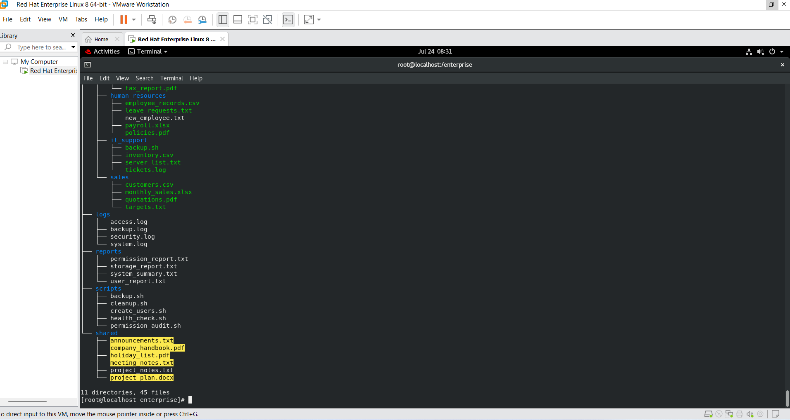
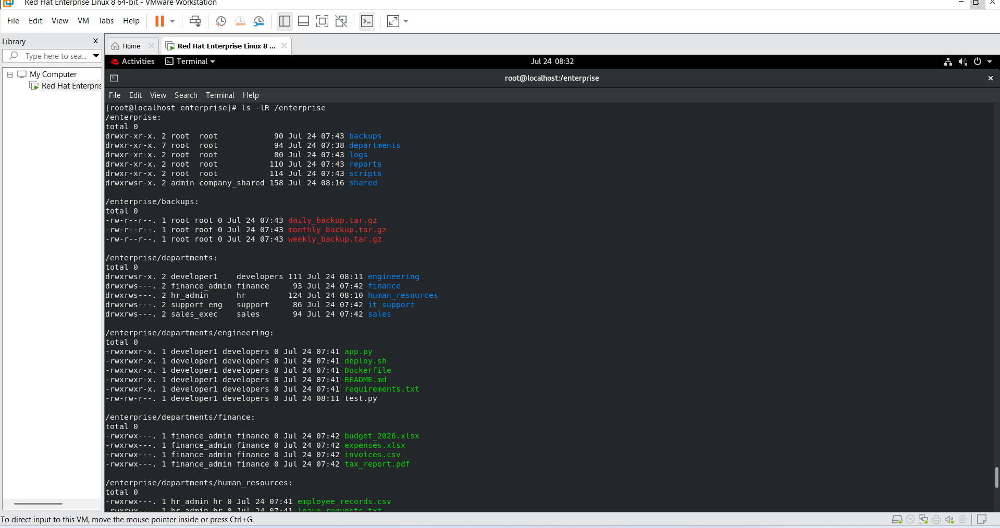
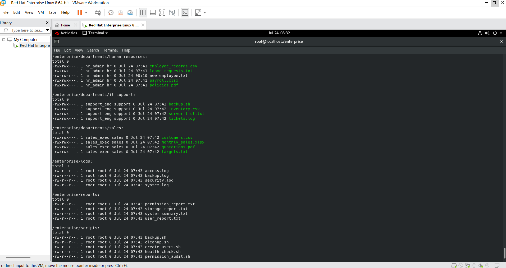
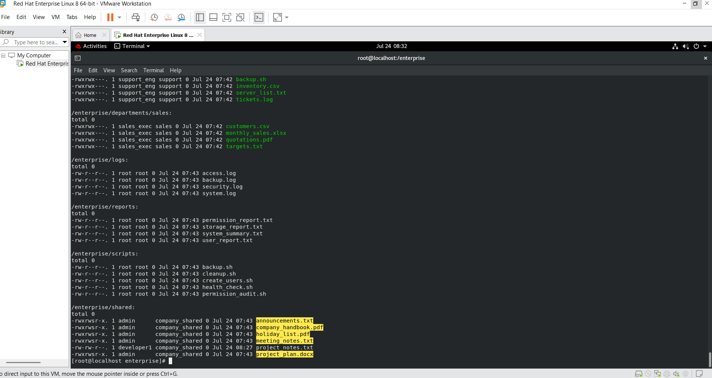
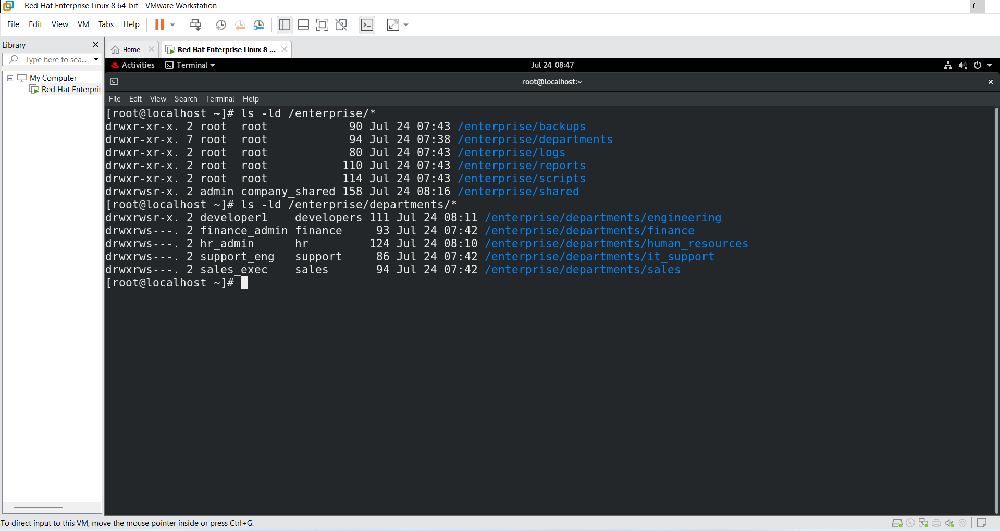
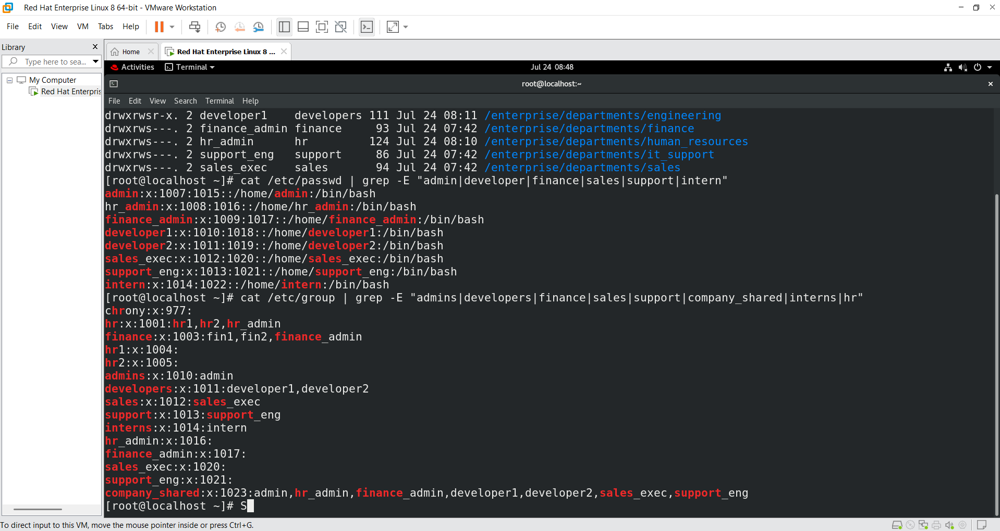
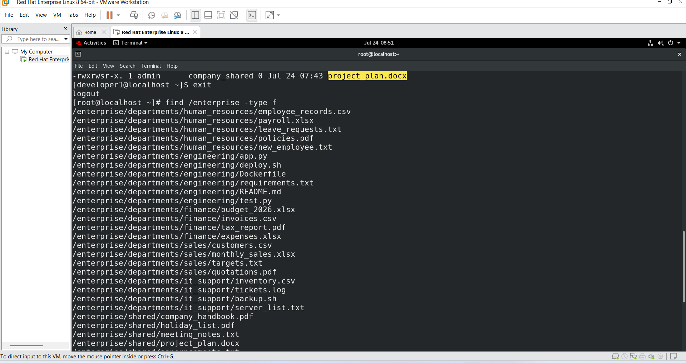

# Enterprise-linux-user-file-access-management
Enterprise Linux User, File &amp; Access Management System built on Red Hat Enterprise Linux 8 demonstrating Linux administration, user management, permissions, SGID, and enterprise access control.
# 🚀 Enterprise Linux User, File & Access Management System (RHEL 8)


## 📖 Project Overview

This project simulates a real-world enterprise Linux server environment using **Red Hat Enterprise Linux 9 (RHEL 9)**.

It demonstrates Linux system administration concepts such as user management, group administration, file permissions, ownership, SGID, and enterprise-level access control through a hands-on project.

The project was built to strengthen Linux fundamentals for **DevOps**, **Cloud**, and **Multi-Cloud** roles.

---

# 🎯 Objectives

- Build an enterprise Linux directory structure
- Create users and groups for different departments
- Configure ownership and permissions
- Implement SGID for collaborative directories
- Test secure access between departments
- Practice real Linux administration commands

---

# 🛠 Technologies Used

| Technology | Purpose |
|------------|---------|
| Red Hat Enterprise Linux 9 | Operating System |
| Bash | Shell Commands |
| Linux CLI | System Administration |
| chmod | Permission Management |
| chown | Ownership Management |
| chgrp | Group Management |
| useradd | User Creation |
| groupadd | Group Creation |
| usermod | User Administration |

---

# 🏢 Enterprise Directory Structure

```text
/enterprise
│
├── backups
├── departments
│   ├── engineering
│   ├── finance
│   ├── human_resources
│   ├── it_support
│   └── sales
│
├── logs
├── reports
├── scripts
└── shared
```

---

# 👥 Users Created

| Username | Department |
|----------|------------|
| admin | Administration |
| hr_admin | Human Resources |
| finance_admin | Finance |
| developer1 | Engineering |
| developer2 | Engineering |
| sales_exec | Sales |
| support_eng | IT Support |
| intern | Internship |

---

# 👨‍💻 Groups Created

- admins
- hr
- finance
- developers
- sales
- support
- interns
- company_shared

---

# 🔐 Linux Concepts Implemented

- Linux File System Hierarchy
- File & Directory Management
- User Administration
- Group Administration
- Ownership Management
- File Permissions
- SGID
- Shared Directory Configuration
- Enterprise Access Control

---

# 📸 Project Screenshots

## Project Structure



## Department Directories



## User Creation



## Group Creation



## Permission Configuration



## SGID Configuration


## Shared Directory



## Access Test


## Find Commands



## Final Output


---

# 📚 Commands Practiced

```bash
mkdir
touch
cp
mv
rm
ls
tree
find
grep
chmod
chown
chgrp
useradd
groupadd
passwd
usermod
id
su
```

---

# 🎓 Learning Outcomes

After completing this project, I gained practical experience in:

- Linux File System Management
- Enterprise Directory Design
- User & Group Administration
- Linux File Permissions
- Ownership Management
- SGID
- Shared Directory Configuration
- Linux Security Basics
- Access Control Validation

---

# 🚀 Future Enhancements

- Logical Volume Manager (LVM)
- Disk Partitioning
- File Systems (XFS/EXT4)
- Networking Configuration
- SSH Administration
- Firewall Configuration
- Shell Scripting Automation
- Cron Jobs
- Service Management
- Log Monitoring
- Ansible Automation

---

# 📂 Repository Structure

```text
Enterprise-linux-user-file-access-management
│
├── README.md
├── LICENSE
├── docs/
├── scripts/
└── screenshots/
```

---

# 👨‍💻 Author

**Prem Kumar**

Aspiring Linux | DevOps | Multi-Cloud Engineer

📍 Bangalore, India

---

⭐ If you found this project useful, consider giving it a star!
